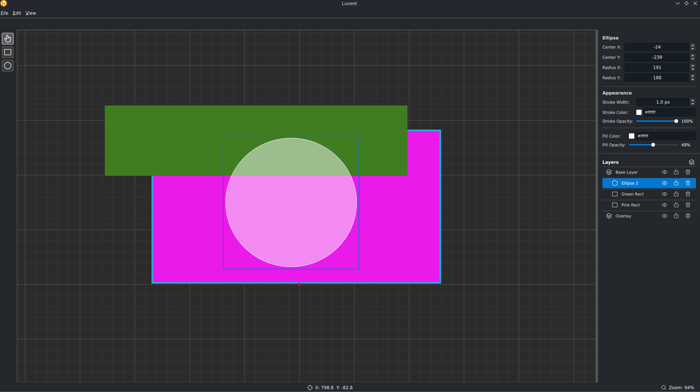

# Lucent Designer

## What
A modern, open source hybrid vector/raster digital design application, built with QT.

## The Experiment
This exists mainly because there isn't a good alternative to Affinity Designer on Linux, and with it's recent purchase by Canva and the quick enshittification of Affinity, it's pushed me to at least take a stab at some sort of alternative.

Additionaly I want to see how far I can push current AI assisted coding techniques. Can I build in guardrails and agile principles to the process, in order to get stable, usable software out the other side? What would that look like in the open source model, and how can we accept useful contributions while minimizing AI slop generation and code bloat?

## Contributing
There's plenty to do but the end goal is pretty clear for me, so if you want to help out, I'd love any help. Checkout the issues or open an issue if you found some while playing with the application. What tools are missing from the software?

### Getting Started
- Clone the Repo
- Install Python 3.10
- Create/activate the project venv: `python -m venv .venv && source .venv/bin/activate`
- Install deps: `pip install -r requirements.txt -r requirements-dev.txt`
- Install the app package (src layout): `pip install -e .`
- Install hooks: `pre-commit install`

Run the app: `python main.py`

Run tests: `pytest -q`
